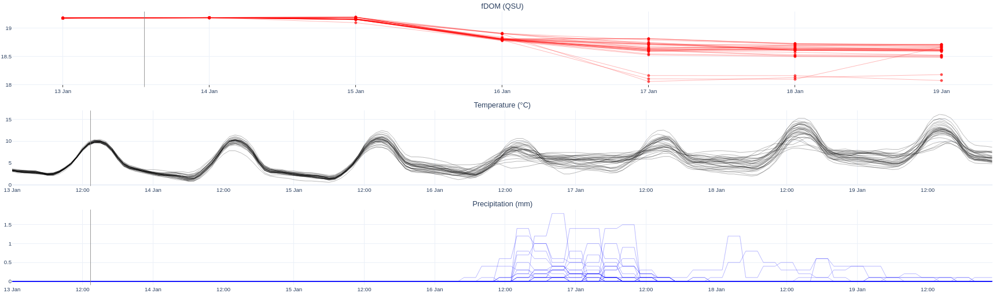

# fDOM Weather App

This repository contains the **fDOM Weather App**, an online tool designed to provide fluorescence Dissolved Organic Matter (fDOM) forecasts based on meteorological and soil data. The application integrates weather forecast data from the Global Forecast System (GFS) with machine learning models to deliver 7-day fDOM predictions. The tool is updated every 3 hours to ensure the most up-to-date information is used.



## Features

- **Real-time Weather Data**: Connects to the GFS to download meteorological and soil data for 31 ensemble members.
- **Machine Learning Model**: Utilizes a pre-trained Random Forest model to predict fDOM levels.
- **7-Day Forecasts**: Provides forecasts for the upcoming week based on the latest data.
- **Frequent Updates**: The application updates its forecasts every 3 hours.

## How It Works

1. **Data Retrieval**: The application fetches weather and soil data from the GFS for 31 ensemble members.
2. **Model Execution**: The retrieved data is passed through a Random Forest model trained to predict fDOM values.
3. **Forecast Generation**: The model outputs fDOM predictions for the next 7 days.
4. **Online Access**: Users can access the forecasts through the online tool.

## Code Overview

### `app_ensemble_fdom.py`

This is the main script that powers the fDOM Weather App. Below is an overview of its key components:

- **Data Handling**:
  - Downloads meteorological and soil data for the 31 ensemble members from the GFS.
  - Preprocesses the data to ensure it is ready for input into the machine learning model.

- **Model Prediction**:
  - Loads the pre-trained Random Forest model.
  - Uses the model to predict fDOM values for each ensemble member.
  - Aggregates the results to provide a robust forecast.

- **Forecast Output**:
  - Generates and formats the forecast results for online visualization and user access.

- **Error Handling**:
  - Includes mechanisms to manage missing data and ensure smooth operation in case of API downtime.

## Current Limitations

This is the **first version** of the fDOM Weather App. While it provides valuable insights, a **full analysis of uncertainties** in the predictions is still required to enhance its reliability and accuracy.

## Funding Acknowledgment

This tool has received funding from [intoDBP](https://intodbp.eu/). IntoDBP is an EU-funded project that will develop, test, scale-up, validate, and benchmark innovative tools and strategies to protect catchments and minimize human exposure to disinfection by-products (DBP) under current and future climates, without compromising disinfection efficacy, and which could be applied at the global scale. The project will develop its cross-cutting solutions on 4 complementary case studies (CS) combining rural and dense urban areas, from 3 European countries where disinfection by-products are a scientific, technological, and political challenge.


## Future Improvements

- Comprehensive uncertainty analysis to refine prediction confidence.
- Integration of additional weather models for ensemble forecasting.
- Enhanced visualization tools for a more user-friendly interface.
- Support for other environmental variables beyond fDOM.

## Getting Started

To use the app:

1. Clone this repository:
   ```bash
   git clone https://github.com/danielmerbet/fdom_weather_app.git
   ```
2. Navigate to the project directory:
   ```bash
   cd fdom_weather_app
   ```
3. Install the required dependencies:
   ```bash
   pip install -r requirements.txt
   ```
4. Run the application:
   ```bash
   python app_ensemble_fdom.py
   ```

## Contributions

Contributions are welcome! If you have suggestions for improving the app or addressing current limitations, please submit an issue or a pull request.

## License

This project is licensed under the MIT License. See the [LICENSE](LICENSE) file for details.

---

